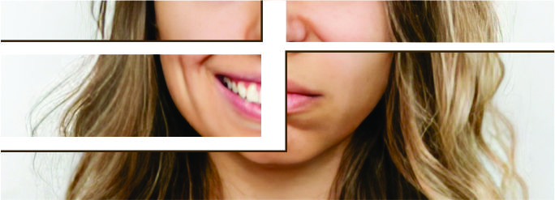
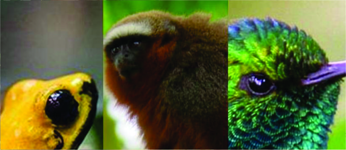

<!DOCTYPE html>
<html lang="es">
<head>
  <meta charset="UTF-8">
  <meta name="viewport" content="width=device-width, initial-scale=1.0">
  <title>Café para todos</title>
  <meta name="description" content="Explora el mundo del café colombiano, bienestar natural y cultura cafetera.">
  
</head>
<body>

  <header>
    
    

      
Bienestar, naturaleza y cultura cafetera

    

  </header>

 <nav aria-label="Menú principal">
  <a href="web todos 2.html">Inicio</a>
  <a href="historia.html">Historia</a>
  <a href="animales.html">Animales</a>
  <a href="catalogo.html">Catálogo</a>
  <a href="ejercicios.html">Ejercicios para casa</a>
</nav>

  <section id="inicio" class="grid">
    

      <h3>¿Estás estresado?</h3>
      
Descubre cómo el café y la respiración consciente pueden ayudarte a relajarte.

      
      <a href="ejercicios.html" class="button">Explorar ejercicios</a>
    

    

      <h3>Café en Colombia</h3>
      
Conoce el proceso de cultivo y la historia detrás del café colombiano.

      
      <a href="historia.html" class="button">Leer más</a>
    

    

      <h3>Animales autóctonos</h3>
      
Explora la fauna nativa que habita en las regiones cafeteras.

      
      <a href="animales.html" class="button">Ver especies</a>
    

       

      <h3>Compras</h3>
      
Explora nuestro menú de cafés artesanales y realiza tu pedido.

      
      <a href="catalogo.html" class="button">Ver productos</a>
    

  </section>

  <footer aria-label="Pie de página">
    
&copy; 2025 Café para todos. Todos los derechos reservados.

  </footer>

</body>
</html>
